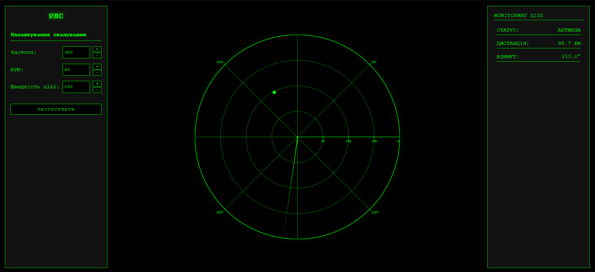
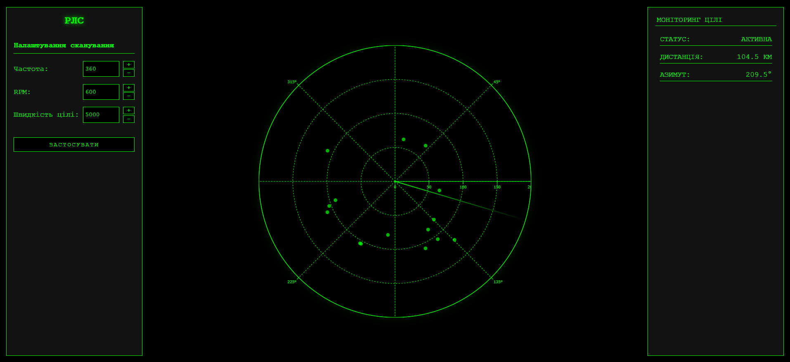

# Лабораторна робота 4: Розробка додатку для візуалізації вимірювань радару

 

## Мета роботи
Розробка веб-додатку для візуалізації даних радарних вимірювань у реальному часі з використанням полярної системи координат та можливістю налаштування параметрів сканування через програмний інтерфейс.

## Теоретичні відомості
Радарна система використовує випромінювання та прийом відбитих радіохвиль для виявлення об'єктів. Основними параметрами роботи радару є частота випромінювання імпульсів, швидкість обертання антени та швидкість руху цілей. Візуалізація даних здійснюється на круговій розгортці, де відстань від центру відповідає дальності цілі, а кутове положення - напрямку на ціль.

## Практична реалізація

### Базовий інтерфейс системи

 

Початковий стан системи з налаштуваннями за замовчуванням

Розроблений інтерфейс надає можливість налаштування трьох основних параметрів роботи радару:
- Частота вимірювань за оберт: визначає детальність сканування простору
- Швидкість обертання антени: впливає на частоту оновлення даних про цілі
- Швидкість руху цілей: дозволяє симулювати об'єкти з різною динамікою руху

### Демонстрація роботи з різними параметрами

 

Візуалізація при збільшених параметрах сканування

При збільшенні швидкості обертання антени до 600 об/хв та швидкості цілей до 5000 км/год спостерігається суттєва зміна характеру відображення даних. Зростає динамічність оновлення інформації, що дозволяє ефективніше відслідковувати швидкорухомі об'єкти. Водночас висока частота вимірювань (360 точок за оберт) забезпечує детальне сканування простору без втрати роздільної здатності системи.

## Висновок
Розроблений програмний комплекс успішно реалізує візуалізацію радарних даних у реальному часі та дозволяє гнучко налаштовувати параметри роботи системи. Реалізований інтерфейс забезпечує інтуїтивно зрозуміле керування та наочне представлення результатів вимірювань. Проведене тестування підтвердило коректність роботи системи в різних режимах сканування простору.
