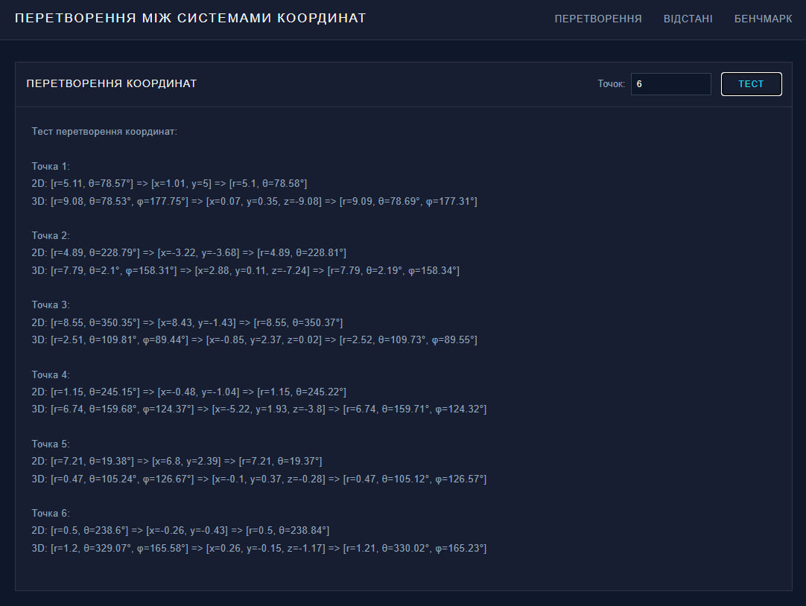
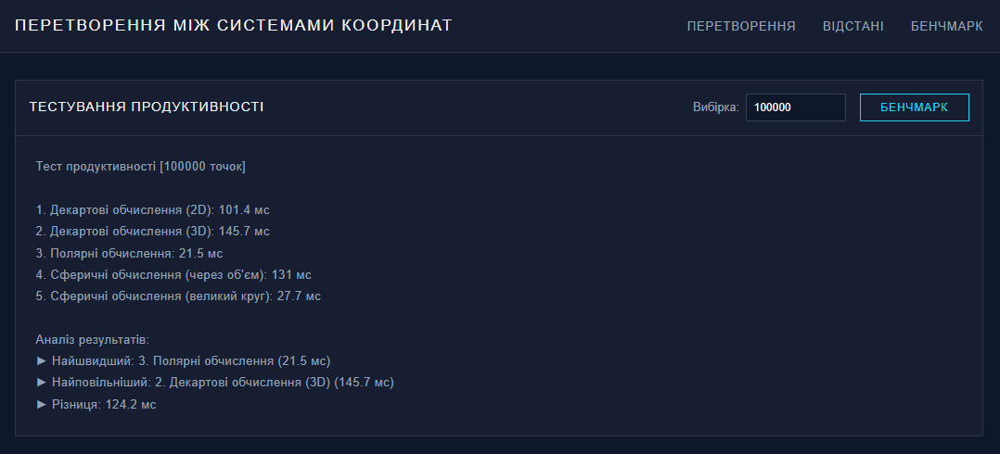

# Лабораторна робота 3: Реалізація перетворень між системами координат

 

## Мета роботи
Розробка та імплементація програмного забезпечення для виконання перетворень між різними системами координат з подальшим аналізом ефективності методів обчислення відстаней.

## Теоретична частина
Дослідження базується на математичних принципах перетворення координат між декартовою, полярною та сферичною системами. Основою для обчислень слугують тригонометричні функції та векторна алгебра. Програмна реалізація включає методи конвертації координат та розрахунку відстаней з використанням різних математичних підходів.

## Практична реалізація

 

Інтерфейс системи координатних перетворень

Розроблене програмне забезпечення надає інструментарій для перетворення координат між системами. Графічний інтерфейс забезпечує введення даних та відображення результатів обчислень. При розробці застосовано принципи об'єктно-орієнтованого програмування та сучасні технології веб-розробки.

 

Демонстрація обчислення відстаней

Реалізовано алгоритми обчислення відстаней між точками з використанням формул евклідової геометрії та сферичної тригонометрії. Імплементація включає методи розрахунку як прямих відстаней, так і дуг великого кола для сферичної системи координат.

 

Результати тестування продуктивності

## Експериментальні дослідження
Проведено серію експериментів з вибіркою 100 000 точок для оцінки ефективності різних методів обчислення. Виміряно час виконання операцій для кожного методу: декартові обчислення у двовимірному (101.4 мс) та тривимірному просторі (145.7 мс), полярні обчислення (21.5 мс), сферичні обчислення через об'єм (131.0 мс) та метод великого круга (27.7 мс).

## Висновки
Експериментальні дослідження продемонстрували суттєву перевагу полярних обчислень за критерієм швидкодії. Найменш ефективним виявився метод декартових обчислень у тривимірному просторі. Різниця у часі виконання між найшвидшим та найповільнішим методами становить 124.2 мс, що є значущим показником при масових обчисленнях.
